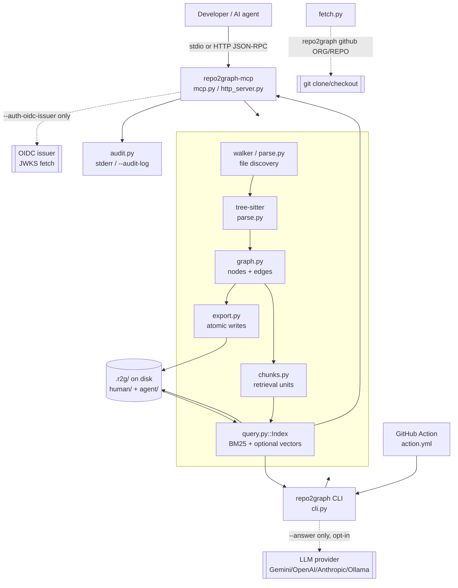

# Security audit — 2026-09-17

A whole-repository security and production-readiness audit, run against `remove-authormark-watermark`
(parent `f8a38a0`, 838 tests passing before this audit's own changes). This is **not** the first
security pass this codebase has had — `DONE.md` and `docs/BACKLOG.md` record two prior hardening
runs (encoding/traversal fixes in 2026-09, then incremental build + MCP/HTTP/auth in 2026-09) that
already closed a long list of findings. This audit's job was to verify those claims against the
actual code rather than the documentation, and to find what, if anything, is still open.

**Method.** Four independent read-only passes (filesystem/symlink/git, MCP/HTTP/auth/audit-log,
CI/CD/supply-chain, parser/resource-exhaustion/graph-correctness), each required to cite `file:line`
evidence for every claim — "already handled" or "gap" — rather than assert from memory. Findings
below are deduplicated and, where a fork's severity call didn't hold up against GitHub's actual
platform behavior, corrected with the reasoning shown (see P1 below).

## Architecture



Three surfaces (CLI, GitHub Action, MCP server) share one engine (`Index`, `build()`, `dump_all()`)
over one on-disk format (`.r2g/`). No surface calls an LLM itself except the two explicitly-gated
exceptions shown dashed above.

### Entry points

| Surface | Entry point | Trust of caller |
|---|---|---|
| CLI | `repo2graph.cli:main` | Operator at a local shell — fully trusted |
| GitHub Action | `action.yml` → `repo2graph` CLI | The workflow's own `permissions:`, not repo content |
| MCP stdio | `repo2graph.mcp:main` → `serve()` | Whatever spawned the process (a client, e.g. Claude Code) |
| MCP HTTP | `http_server.py::serve_http` | Untrusted network caller, gated by `auth.py` |

### Pipeline

1. **Discovery** (`parse.py::discover`) — `git ls-files` (when the target is a git checkout) or
   `os.walk` fallback, both filtered through `DEFAULT_SKIP_DIRS`, a 1.5 MB per-file size cap
   (`MAX_BYTES`), and `lstat()`-based symlink exclusion.
2. **Parsing** (`parse.py`, tree-sitter) — per-file, wrapped in a bare `except Exception` so one
   pathological file cannot abort a build (`graph.py:203-209`).
3. **Graph construction** (`graph.py`) — name-based `CALLS` resolution with `confidence = 1/n` for
   ambiguous matches, `INHERITS`, `IMPORTS`, entrypoint/reach analysis, optional `CO_CHANGE` edges
   from `git log`.
4. **Chunking** (`chunks.py`) — one retrieval unit roughly per function/class, each carrying its
   graph neighbourhood in a header.
5. **Export** (`export.py`) — every artifact written via `atomic_write` (temp file + `os.replace`),
   split into `human/` (pictures, for people) and `agent/` (JSONL/JSON, for programs).
6. **Retrieval** (`query.py::Index`) — BM25 plus an optional dense-vector fusion path
   (`embed.py`, stdlib-only `.npy` reader so querying never requires `numpy`), budget-bounded
   packing (`pack_context`).
7. **Serving** — the CLI prints directly; the MCP server wraps the same `Index` behind
   `dispatch()`, `auth.py` (HTTP only), `audit.py`, and `cache.py`.

### Caching and persistence

- **On disk:** `.r2g/agent/parse.cache.json` (per-file sha256 + parsed symbols, for
  `build --incremental`), `.r2g/agent/vectors.npy` + `.meta.json`, `.r2g/agent/index.state.json`.
  All written only inside the output directory the operator named — never outside it, and only via
  `atomic_write`.
- **In-process:** `cache.py::ResultCache`, an in-memory bounded/expiring `OrderedDict` keyed on
  canonical JSON of tool arguments. Never touches disk; cleared wholesale on any rebuild.

### Dependencies

Required: `tree-sitter`, `tree-sitter-language-pack` (both parsers). Optional extras, never
imported unless requested: `rag` (`sentence-transformers`, `numpy`), `mcp` (`mcp>=1.0,<2`). No
graph library (no NetworkX) — layout and GraphML/Cypher generation are pure Python. Verified by a
real test: `import repo2graph.query` / `.embed` / `.mcp` leave `numpy`/`sentence_transformers`/
`mcp` out of `sys.modules` (`tests/test_compat.py`).

## Threat model

| Actor | Capability | Relevant boundary |
|---|---|---|
| Malicious repository content | Controls file names, paths, source text, git history, commit messages | Discovery, parser, chunk/graph content, generated HTML/GraphRAG pack |
| Malicious MCP client / caller | Controls every tool argument (`query`, `node_id`, `k`, `hops`, `budget_tokens`, `task_id`) | `mcp.py::dispatch` and its handlers |
| Network attacker (HTTP transport) | Can attempt to reach the HTTP listener, forge bearer tokens/JWTs | `auth.py`, `http_server.py` |
| Compromised/malicious dependency | Supply-chain injection via PyPI or a GitHub Action | `pyproject.toml`/`uv.lock`, `.github/workflows/*` |
| Forked-repo PR author (CI) | Can edit workflow YAML in their own PR | Any workflow triggered on `pull_request`/`pull_request_target` |
| Local co-resident process | Can race a TOCTOU window between `lstat()` and `open()` | File read path (see P3 below) |
| Malicious git remote (`repo2graph github`) | Controls clone content, cannot control the clone *command* | `fetch.py` |
| Consuming AI agent | Receives tool output as context; a client bug could mistake repository content for instructions | MCP response → AI model (inherently client-side, see below) |

Explicitly **not** modelled as a threat here: the operator running the CLI locally (they already
have filesystem access equal to or greater than anything repo2graph could expose), and a fully
compromised host OS (no application-layer control defends against that — see
`docs/ENTERPRISE_DEPLOYMENT.md`).

## Trust boundaries

1. **AI agent / MCP client → MCP server.** Untrusted. Every tool argument is coerced and clamped
   in the handler (`_int`, `_clamp`, and — as of this audit — `_str`), never trusted as already
   valid. `dispatch()`'s own docstring: "arguments... are JSON a model wrote and are treated as
   hostile throughout."
2. **Repository content → parser/graph/chunks.** Untrusted. Tree-sitter failures are caught per
   file; no file content is ever executed, evaluated, or deserialized unsafely (no `eval`, `exec`,
   or unsafe `pickle` anywhere in `repo2graph/`).
3. **Repository content → MCP/HTTP response.** Untrusted data returned as inert text. Secrets are
   excluded unconditionally on every MCP tool (`exclude_secrets=True`, hardcoded, no argument can
   disable it). See P4 in "MCP output as untrusted data" below for what this boundary does and does
   not claim about prompt injection.
4. **MCP process → filesystem.** The repo path is supplied only by the trusted operator at process
   startup (a CLI argument), never by a tool-call argument — a caller cannot redirect which
   directory gets indexed.
5. **MCP process → network.** No outbound call in default mode. The one exception,
   `--auth-oidc-issuer`, is explicit, https-only, size-capped (`MAX_JWKS_BYTES`), and
   timeout-bound (`auth.py:262-278`).
6. **MCP process → git.** Every git invocation is an argv list, never `shell=True`, always
   timeout-bound, `stdin=DEVNULL`.
7. **CLI process → LLM provider.** Only `rag --answer`, explicitly opt-in, hostname printed to
   stderr before the request, secrets excluded from the pack by the same code path.
8. **Package manager → installed package.** SHA-pinned Actions, `uv.lock` committed, OIDC Trusted
   Publishing to PyPI (no long-lived token).
9. **Forked PR → CI secrets.** GitHub withholds repository secrets from `pull_request`-triggered
   (not `pull_request_target`) workflow runs whose head is a fork; `claude-code-review.yml` now
   makes that boundary explicit rather than implicit (fixed in this audit, see P1).

## Data flow

```
repo source (untrusted) → discover() [size cap, symlink excluded, skip-dirs]
  → tree-sitter parse [per-file try/except, 1.5MB cap]
  → graph nodes/edges [no execution, name-based resolution only]
  → chunks [text slices of the same bytes, no transformation that could inject]
  → .r2g/ on disk [atomic writes, inside the operator-chosen outdir only]
  → Index (BM25 + optional vectors)
  → pack_context() [budget-bounded, secrets excluded on the MCP/--answer paths]
  → MCP tool result / CLI stdout
  → AI client (trust boundary the client owns, not this server)
```

None of these stages execute repository content, follow a path outside the discovered tree (see P3
below for the one residual TOCTOU case), or make a network call outside the two explicitly-gated
exceptions.

## Findings

Ranked P0 (critical security boundary) → P3 (quality/hardening). **No P0 findings.** One finding
was reported as P1 by its originating pass and is downgraded here with the reasoning shown, because
overstating severity is its own failure mode (§68, "no security theater").

### P1 — none confirmed at P1 after verification

*Originally reported P1, downgraded to P3 on review:* the CI/CD audit flagged
`claude-code-review.yml` triggering on plain `pull_request` while passing
`secrets.CLAUDE_CODE_OAUTH_TOKEN`, reasoning that a fork PR could edit the workflow file to
exfiltrate the secret. This does not hold: GitHub does not pass repository secrets to workflow runs
triggered by `pull_request` (as opposed to `pull_request_target`) when the head is a fork — this is
a platform-level control, not something this workflow configures, and has been GitHub's default
behaviour since Actions launched. The real, narrower exposure is a same-repo branch (an
already-trusted contributor with push access), which is a much smaller blast radius than "any fork
PR." **Fixed anyway**, as defense-in-depth and to make the boundary explicit rather than implicit:
`claude-code-review.yml` now carries
`if: github.event.pull_request.head.repo.full_name == github.repository`, so the step is skipped
entirely for fork PRs regardless of what the platform default happens to be at the time, including
if an org-level "send secrets to fork PRs" setting is ever enabled.

### P2

1. **Audit log `error` field bypassed redaction.** `repo2graph/audit.py:318-328` (pre-fix):
   `sanitize_params(params)` ran on `params`, but `"error": error` was written verbatim.
   `http_server.py` calls `self.audit.record(..., error=str(exc))` in several places; if an
   exception's `str()` ever echoes a credential-shaped value (a downstream library, an OS error
   embedding a path with a token), it would land unredacted in a log explicitly designed to be
   retained and shipped to a SIEM.
   **Fixed:** `audit.py:327` now routes `error` through `sanitize_value("error", error)`. Regression
   test: `tests/test_audit.py::test_a_secret_embedded_in_an_error_message_is_redacted`.

2. **No length ceiling on MCP string arguments.** `repo2graph/mcp.py`: every numeric tool argument
   (`k`, `hops`, `limit`, `budget_tokens`) was clamped in its handler, but `query`, `node_id`, and
   `task_id` had none — an arbitrarily long string reached `index.pack_context()` / dict lookups.
   Lower severity because the HTTP transport already bounds the whole request body
   (`MAX_BODY_BYTES = 1<<20`, `http_server.py:40`) and stdio's own threat model treats the caller as
   already privileged enough to spawn the process — but "every MCP tool argument is caller-hostile"
   (`AGENTS.md`) is a stated design invariant, and this was the string-typed exception to it.
   **Fixed:** `MCP_MAX_QUERY_CHARS`, `MCP_MAX_NODE_ID_CHARS`, `MCP_MAX_TASK_ID_CHARS` and a new
   `_str()` coercion helper, applied inside `tool_repo_search`, `tool_repo_neighbours`, and
   `tool_build_status` — the same handler-level placement as the existing numeric `_clamp` calls, so
   both `dispatch()` and any direct caller inherit the bound. Regression tests: `tests/test_mcp.py`,
   `test_r9_*` (flooded with 10MB strings, matching the existing `test_r5_*` flooding convention).

3. **No per-file parse timeout.** `parse.py:463` (`parser.parse(source)`) has no
   `set_timeout_micros`/wall-clock guard. `MAX_BYTES = 1_500_000` bounds file *size*, not parse
   *time*; a file within the size cap but with pathologically deep/repetitive nesting could still
   consume disproportionate CPU in one worker. Mitigated in practice — the process pool
   (`graph.py:355`, `PARALLEL_MIN_FILES=64`) isolates a slow file to one worker rather than the
   whole build, and tree-sitter's parser is not backtracking-prone the way a regex engine is — but
   this is residual risk, not a closed door, and no test proves a bound exists.
   **Not fixed in this pass:** `tree_sitter.Parser.set_timeout_micros` support varies across grammar
   bindings in the `tree-sitter-language-pack`, and adding a wrong per-language timeout risks
   false-positive truncated parses on legitimately large generated files (which repositories do
   have) with no fixture to prove the timeout is well-calibrated. Tracked in `docs/BACKLOG.md`.

4. **No SBOM generated in CI.** Confirmed absent (grepped all workflow files for `sbom`,
   `cyclonedx`, `syft` — zero hits). `dependency-audit.yml` runs `pip-audit --strict`, which is a
   vulnerability gate, not a bill-of-materials artifact a downstream consumer can ingest.
   `uv.lock` is committed and reproducible, which is adjacent but not equivalent.
   **Not fixed in this pass** — adding a CycloneDX export step is straightforward but changes a
   release-facing CI artifact, which the audit scope treats as a deliberate, separately-reviewed
   change rather than a drive-by edit. Tracked in `docs/BACKLOG.md`.

### P3

1. **TOCTOU symlink race on file read.** `parse.py:249-253` (`discover()`) correctly excludes
   symlinks using `lstat()` + `S_ISREG` at discovery time, but the later read
   (`graph.py::_read_and_parse`) opens the path again without `O_NOFOLLOW`. A local attacker who can
   race the indexing process on the same machine — replacing a regular file with a symlink to
   `~/.ssh/id_rsa` between discovery and read — could have its target indexed. Remote/repo-content
   attackers cannot trigger this; it requires local code execution on the same host, which is
   already a stronger position than anything repo2graph could additionally protect against.
   `O_NOFOLLOW` is POSIX-only and unavailable on Windows, so this cannot be fully closed
   cross-platform. **Documented as a known limitation** (see `docs/SECURITY-AUDIT.md`'s "what this
   does not protect against" below and `docs/ENTERPRISE_DEPLOYMENT.md`) rather than partially fixed
   with a platform-conditional guard that would need its own test matrix to trust.
2. **`git log --name-only` cochange output has no independent byte-size cap.**
   `graph.py:563-566` is bounded by `MAX_COCHANGE_COMMITS` and a 120s timeout, not by output size —
   a repo with pathologically long commit messages across the commit window has no explicit ceiling
   before decode. Low risk (a local repo's own history, not attacker-controlled network input).
   Tracked in `docs/BACKLOG.md`.
3. **Secret-path denylist is not user-configurable.** `query.py:56-98`'s `SECRET_KEYWORDS`/
   `SECRET_DIR_NAMES` is a solid, independent-of-`.gitignore` denylist, but it's a hardcoded
   module-level `frozenset` with no CLI flag or config file to extend it for an org's nonstandard
   secret-file naming. Tracked in `docs/BACKLOG.md`.
4. **HTTP transport returns `str(exc)` verbatim to the client.** `http_server.py:247,332,338`.
   Not a confirmed secret-leak path today, but internal exception text (occasionally a local path)
   reaches an untrusted network caller in the JSON-RPC error body. Tracked in `docs/BACKLOG.md`.
5. **No enforced cap on total graph nodes/edges/files.** `graph.py:367,393`'s `max_files` is
   opt-in and defaults to unbounded. A sufficiently large/adversarial tree (millions of generated
   files) has no built-in memory ceiling; `Graph.nodes`/`edges` are fully in-memory. Chunk emission
   is already streamed (`chunks.py:69-76`), so this is specifically a graph-construction-phase risk.
   Tracked in `docs/BACKLOG.md`.
6. **No `docs/PERFORMANCE.md` prior to this audit.** Fixed — see that file, now with real
   measurements rather than claims.
7. **Release tag `@v1` is a moving pointer, not an integrity pin.** `publish.yml`'s release
   stage force-pushes `v1` to the latest release SHA — a deliberate, documented convenience so
   consumers can write `uses: .../repo2graph@v1`, but it means `@v1` itself carries no supply-chain
   integrity guarantee the way a SHA pin does. `SECURITY.md` now says so explicitly.
8. **No explicit `attestations:` flag on the PyPI publish step.** OIDC Trusted Publishing is
   correctly configured (no long-lived token), but whether `pypa/gh-action-pypi-publish` emits PEP
   740 attestations by default at the pinned SHA wasn't verified from the YAML alone. Tracked in
   `docs/BACKLOG.md` as worth an explicit flag once confirmed safe to set.

### Already handled — verified with evidence, not re-derived

**Filesystem / symlinks / secrets / git:**
- Symlinks never indexed: `parse.py:249-253` uses `lstat()` (not `stat()`), requires `S_ISREG`;
  `os.walk` uses the Python default `followlinks=False`.
- Independent secret-file denylist, unconditional on the MCP path: `query.py:79-99`
  `_is_secret_path()`, enforced on all three MCP tools per `SECURITY.md`.
- Every subprocess call uses argv arrays, no shell, explicit timeouts, `stdin=DEVNULL`:
  `parse.py:163-167`, `graph.py:563-566`, `fetch.py:128-130,155-157,170-172`.
- Clone-spec injection blocked: `fetch.py:60-72` rejects `owner`/`repo` components that are `.`,
  `..`, or start with `-` before they reach `git clone`'s argv.
- Credentials never touch argv or a URL: `fetch.py:87-113` uses `GIT_CONFIG_KEY_N`/
  `GIT_CONFIG_VALUE_N` env vars; `_redact()` strips raw/base64/URL-encoded token forms from error
  text.
- No `eval`/`exec`/unsafe `pickle`/`os.system`/`os.popen`/`shell=True` anywhere in `repo2graph/`.
- All disk artifacts written via `export.atomic_write` (temp file + `os.replace`).

**MCP / HTTP / auth / audit:**
- Every numeric tool argument is clamped in the handler and proven by tests that flood the ceiling
  with `10**9`/`10**12`/negative values (`tests/test_mcp.py`, `test_r5_*`).
- `exclude_secrets=True` is unconditional and hardcoded in every handler.
- HTTP transport refuses to bind beyond loopback with no auth configured:
  `http_server.py:426-430`.
- Real RS256-only JWT verification: `alg` taken from the key not the token (blocks `alg:none`/
  HS256 confusion), constant-time bearer comparison (`hmac.compare_digest`), `iss`/`aud`/`exp`/
  `nbf` enforced, unknown-`kid` JWKS refetch capped per kid and per refresh
  interval (not per request), with the fetch performed outside the cache lock.
- No outbound network in default mode; OIDC fetch only fires when explicitly configured, and is
  https-only, size-capped, timeout-bound.

**CI/CD / supply chain:**
- Every third-party `uses:` across all 10 workflows is pinned to a full 40-char commit SHA.
- Least-privilege `permissions:` blocks, scoped per job, in every workflow.
- No `pull_request_target` anywhere in the repo.
- No shell injection via unindirected `${{ }}` in `run:` blocks — inputs are routed through `env:`.
- PyPI publish uses OIDC Trusted Publishing, not a static token; `pip-audit --strict` genuinely
  fails CI (not advisory); Dependabot covers `pip` and `github-actions`; REUSE/SPDX compliance is a
  real CI gate; `twine check dist/*` validates package metadata before upload.

**Parser / resource exhaustion / graph:**
- Per-file size cap enforced before read: `parse.py:152-253`, `MAX_BYTES = 1_500_000`.
- A single bad file never aborts a build: `graph.py:203-209`, explicitly commented as intentional.
- `pack_context`'s budget is airtight and cumulative — `fits()` checks before appending, never
  builds the full unbounded string first for the bounded case (`query.py:619-620`).
- viz.py HTML/JS injection is closed and proven: `<` escaped to `<` in the JSON blob, title
  escaped via `html.escape`, single-pass substitution prevents payload re-expansion
  (`viz.py:118-127`), covered by 6+ dedicated tests in `tests/test_viz_safety.py`.
- Dead-code/entrypoint language is correctly hedged: `graph.py:510-519` calls entrypoints "the
  call-graph roots... where a reader tracing a flow has to start," never "safe to delete." Grepped
  the whole repo for "safe to delete" — zero hits.

## MCP output as untrusted data (§17–18 of the brief)

The server does not, and structurally cannot, distinguish "system instruction" from "repository
content" inside a text-only tool result — no MCP transport in the `mcp>=1.0,<2` API this server
targets carries a content-type/trust channel separate from the string payload. What repo2graph does
do:
- Every returned chunk is a **verbatim slice of source bytes**, never reformatted into anything
  that resembles an instruction-shaped wrapper the server itself authored.
- Tool descriptions (what the *client* sees as system metadata) are static strings in
  `TOOL_DESCRIPTIONS`, never built from repository content — a malicious README cannot inject text
  into a tool's own description.
- Secrets are excluded from every returned chunk unconditionally, so credential-shaped content that
  might otherwise be a more attractive injection payload never reaches the response at all.

**What this does not claim:** repo2graph cannot make the *consuming* AI agent immune to a prompt
injection embedded in a comment or README that a search result happens to surface. That is a
property of the client's own system-prompt design, not of this server. This limitation is
documented in `docs/PRIVACY.md` and repeated here so it isn't missed.

## What this does and does not protect against

**Protects against**, with the evidence above: repository content escaping to execute code, secrets
in tracked files reaching an MCP tool result or the audit log, an MCP caller supplying an argument
that costs unbounded time or unbounded response size, network access the operator didn't ask for,
and a compromised or re-tagged upstream GitHub Action silently changing what CI runs.

**Does not protect against**: a compromised developer machine (no application-layer control
defends against that — see `docs/ENTERPRISE_DEPLOYMENT.md`); a client that treats MCP tool output
as instructions rather than data (a client-side property); a local process racing the TOCTOU window
described in P3.1; a repository so large that no configured limit stops it (§P3.5); and, as
`README.md`/`TECHNICAL.md` already state plainly, static-analysis guesses (name-matched `CALLS`,
entrypoint/reach analysis) are not runtime truth — dynamic dispatch, reflection, and plugin
discovery are invisible to a tree-sitter-based reader by construction, not by oversight.
